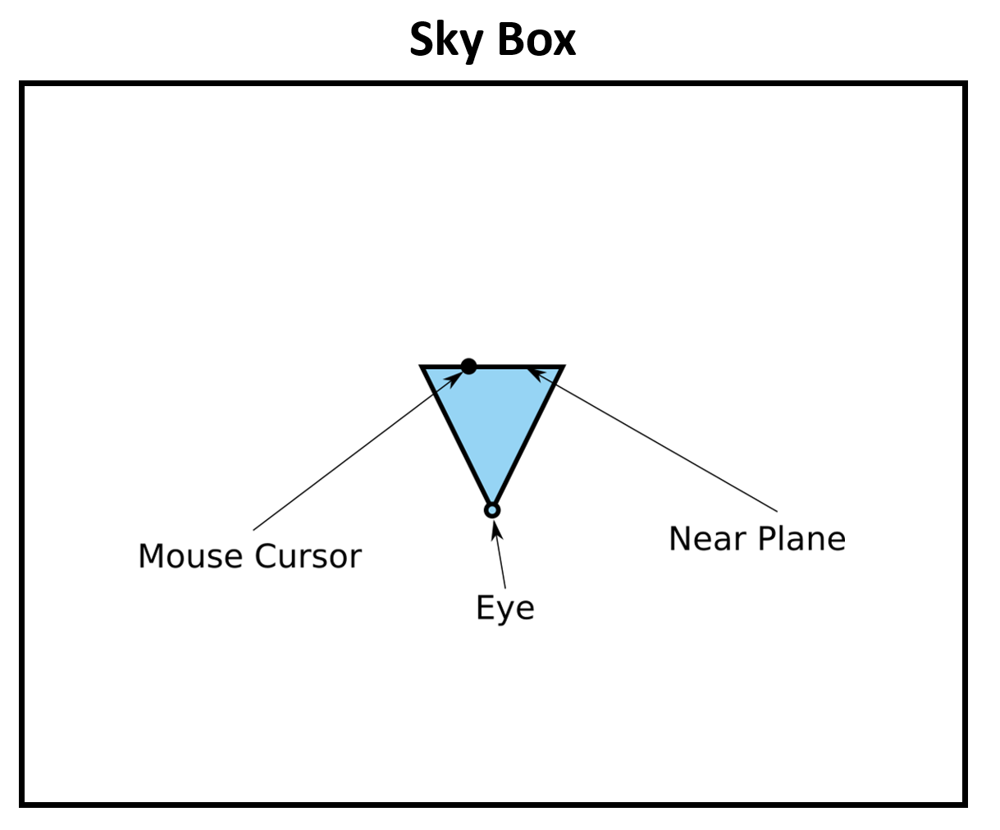
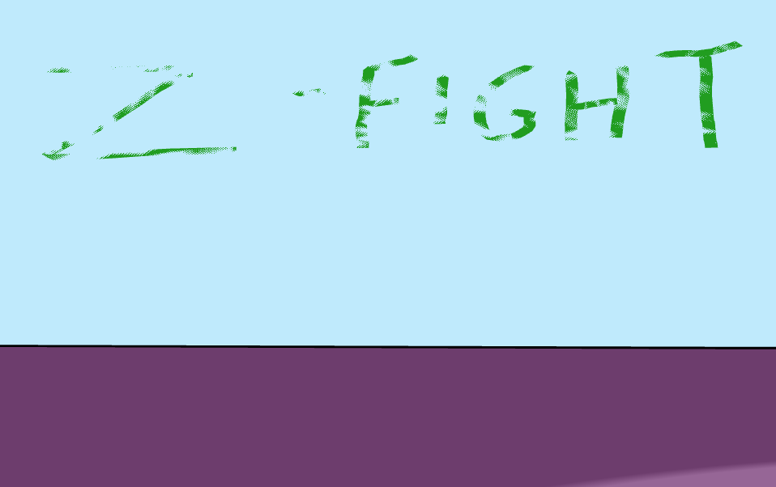

# Assignment 6: A World Made of Drawings

**Due: Monday, December 12, 11:59pm CDT**


The culminating assignment in the course is inspired by the 1955 children's book, [Harold and the Purple Crayon](https://en.wikipedia.org/wiki/Harold_and_the_Purple_Crayon) by Crockett Johnson. Harold is a little boy who creates his own virtual worlds just by drawing them with his magical purple crayon. In this assignment, you will bring Harold's magic to your computer screen.

In addition to inspiring children for decades, Harold can also claim to have inspired some exciting early computer graphics research in non-photorealistic rendering. In this assignment, we will be implemented portions of the paper, [Harold: A World Made of Drawings](https://dl.acm.org/citation.cfm?id=340927), presented by Cohen et al. at ACM NPAR 2000, the 1st International Symposium on Non-Photorealistic Animation and Rendering.  If you like, you can watch a [video of the original system](https://mediaspace.umn.edu/media/t/1_gtj35asj). 

 The lead author of this paper, Jonathan Cohen, was about your age (a junior or senior in college) when he developed this system and published it as his first research paper. He then went on to work on movie special effects at Industrial Light and Magic. This is the kind of thing you may also be able to do if you continue studying computer graphics and get involved in the graphics, visualization, and virtual reality research groups in our department!

In this assignment, you will learn:

- How to perform 3D mesh editing operations in response to user input.
- How to use pick rays and intersection tests to convert 2D screen space coordinates (e.g., the mouse position, a 2D curve onto the screen) into a 3D virtual world.
- How to implement a computer graphics algorithm described in a research paper.

You can try out the [instructor's implementation](https://csci-4611-fall-2022.github.io/Builds/Assignment-6) in the Builds repository on the course GitHub.

## Submission Information

You should fill out this information before submitting your assignment. Make sure to document the name and source of any third party assets that you added, such as models, images, sounds, or any other content used that was not solely written by you. 

Name:

Third Party Assets:

Wizard Bonus Functionality:

## Prerequisites

To work with this code, you will first need to install [Node.js 16.17.0 LTS](https://nodejs.org/) (or newer) and [Visual Studio Code](https://code.visualstudio.com/). 

## Getting Started

The starter code implements the general structure that we reviewed in lecture.  After cloning your repository, you will need to set up the initial project by pulling the dependencies from the node package manager with:

```
npm install
```

This will create a `node_modules` folder in your directory and download all the dependencies needed to run the project.  Note that this folder is `.gitignore` file and should not be committed to your repository.  After that, you can compile and run a server with:

```
npm run start
```

Webpack should launch your program in a web browser automatically.  If not, you can run it by pointing your browser at `http://localhost:8080`.

## Background

The three main features in Harold are: 

1. Drawing hills and valleys on the ground.
2. Drawing strokes in the sky.
3. Drawing billboards, which allow the user to create strokes that show on top of the ground. 

Instead of implementing all three, you will just be implementing #1 and #2. The support code already contains a complete implementation of #3 for you.  Harold is a complete application, so there is quite a bit of support code provided for this assignment. Start by reading through the code, which is heavily commented, and learn how a computer graphics program like this is put together.

The `DrawingApp` class is the main application class and implements the sketch-based user interaction techniques. One of the things that is really cool about Harold is that the user input can be interpreted differently based upon the current content. The original Harold paper did include some drawing modes in order to support some extra features, but for our version, we do not need any buttons to turn on "draw on the sky mode" vs. "draw on the ground mode" vs. "create a billboard mode" – we just draw, and the system figures out our intent. Properties of the path drawn by the user's mouse (called the *stroke*) are used to trigger different 3D modeling operations, as shown in the following table:

| Stroke Made by Mouse                     | 3D Modeling Operation                            |
| ---------------------------------------- | ------------------------------------------------ |
| Starts in the sky                        | Add a new stroke to the sky                      |
| Starts AND ends on the ground            | Edit the ground mesh to create hills and valleys |
| Starts on the ground and ends in the sky | Create a new billboard                           |
| Starts on an existing billboard          | Add the stroke to the existing billboard         |

As the user draws a stroke, the application records the path of the mouse as a series of 2D points, which are stored in the `screenPath` array in the `Billboard` class. You’ll need to work with this array, which is of type `gfx.Vector2`, to implement some of the features.

We can’t draw the `screenPath` directly to the screen – it needs to be converted into triangles first. So, the `Billboard` class also contains a `Mesh`, along with arrays of its 3D vertices and indices. The vertices of the mesh follow the centerline of the `screenPath`, adding just a bit of thickness around it so that it can show up nicely on the screen. You will also need to work with this mesh to implement some of the features.

Please note, the 2D points and vertices stored in `screenPath` are not in pixel units.  Instead, they are in **normalized device coordinates**, where the top left corner of the screen is (-1, 1) and the bottom right is (1, -1).  You can think of this as the 2D equivalent of the **canonical view volume** that we discussed in class. This is convenient because it is the coordinate system that is needed when converting a point on the 2D projection plane to a point in 3D space, and it is the expected input for the `Ray` we will use to implement the 3D modeling operations.

## Part 1: Mouse-Sky Interactions

For this assignment, one of the key parts is to check what part of the virtual environment your mouse is currently touching. This useful for determining what type of stroke should be drawn when the mouse is clicked and dragged.

The "sky" is really just a giant box with a side length of 500 units. In order to calculate where in the sky our mouse is pointing in the scene, we need to perform a *ray-mesh intersection* test. The ray starts at the eye location (camera position), and goes through the current mouse location on the near clipping plane. This ray can be traced to figure out where it intersects the triangles that make up the sky box.  In the illustration below, start out by drawing a line that starts at the eye point, goes through the mouse cursor on the near plane, and then continues to intersect the sky box.



The mouse-sky intersection code needs to be added to the `onMouseDown` method of the `DrawingApp` class. We already have the following variables defined:

- The synthetic camera (`this.camera`)
- The normalized device coordinates of the mouse (`deviceCoords`)
  - Type `gfx.Vector2`
  - Inclusive range [-1, 1]
  - (-1, 1) is the upper left corner, and (1, -1) is the lower right
- A `gfx.Ray` configured using the above two variables.
- The 3D mesh for the sky box (`this.skyBox`)

This gives us all we need to create a pick ray that projects the mouse position to the sky! Take a look at the code blocks for the billboard and ground intersections in the `onMouseDown` method, and try to construct a similar intersection test for the sky sphere, and then create a new `Billboard` at the intersection point.

## Part 2: Drawing in the Sky

It is easier to implement drawing in the sky than editing the ground mesh, so we recommend that you implement this part next.   For this requirement, you will need to complete the code in the `projectToSky()` method of the `Billboard` class.

For this part, you should first take a look at the`projectToNearPlane()`, `projectToWorld()`, and `projectToBillboard()` methods.  These three methods handle the calculations necessary to project the mesh vertices (in normalized device coordinates) to:

1. Draw on the camera near plane while the user is creating the stroke
2. Draw in world space when creating a new billboard
3. Draw in world space when adding to an existing billboard

These methods transform the billboard vertices in different ways, but they will provide a good starting point to figure out the code for raycasting to the sky sphere and then adjusting the position of each vertex.  Similar to the above methods, you will need to loop through all the vertices in the billboard mesh, project them to the sky box, and assign the new vertex positions to the mesh geometry.

Note that if you simply move the vertex the exact point of the sky intersection, you may end up with "z-fighting" where the billboard and sky are both trying to render on top of each other, as shown below.  To fix this, you can move the projected vertex slightly closer to the camera so the sky box is always behind the billboard.




## Part 3: Editing the Ground

The second requirement is to edit the `reshapeGround()` method in the `Ground` class. This is the most complicated part of the assignment, and the code includes extensive comments to help you get started.

The vertices of the ground mesh have already been created.  It is a regular grid of squares, each of which is divided into two triangles, similar to the planar Earth mesh in our previous assignment. To simplify the mesh-editing algorithm, we will not do any adding or subtracting of vertices. All we need to do is move their positions up or down to create hills and valleys. Note that this will mean that some of the triangles will be really stretched out, and you will probably notice some lighting artifacts and geometric distortions.  That is OK, and it isn't too distracting since we are using toon/outline shaders.  (Figuring out ways to overcome these limitations is a great opportunity for a wizardly bonus.)

The specification for how to edit the ground in response to the stroke drawn by the user comes from the Harold research paper. We will follow the algorithm and equations described in Section 4.5 of the paper, which is quoted here:

---

Terrain-editing strokes must start and end on the ground. Call the starting and ending points *S* and *E*… [T]hese two points, together with the **y**-vector, determine a plane in *R3*, that we call the *projection plane*. The points of the terrain-editing stroke are projected onto this plane (this projection, which is a curve in *R3*, is called the *silhouette curve*); the shadow of the resulting curve (as cast by a sun directly overhead) is a path on the ground (we call this the *shadow*). Points near the shadow have their elevation altered by a rule: each point *P* near the shadow computes its new height (*y*-value), *P'y* , as a convex combination


*(This equation is edited slightly from the original text to include the two cases.)*

where *d* is the distance from *P* to the projection plane, *h* is the *y*-value of the silhouette curve over the nearest point on the projection plane to *P*, and *w*(*d*) is a weighting function given by


This gives a parabolic cross-section of width 10 for a curve drawn over level terrain. Other choices for *w* would yield hills with different shapes that might be more intuitive, but this particular choice gives reasonable results in most cases.

Note that if the silhouette curve bends back on itself (i.e. it defines a silhouette that cannot be modeled using a heightfield), then the variation of height along the shadow will be discontinuous. The resulting terrain then may have unexpected features.

---

We have included extensive comments in the `reshapeGround()` method to help you calculate all the parameters for these equations. The *h* in the equation is a complex to calculate, so we have already implemented a function called `computeH()` that you can use to calculate *h* given the silhouette curve, the projection plane, and the closest point on the projection plane to the vertex we are editing.

## Part 4: Walking on the Ground

For the final part of this assignment, you will add some code to the `update()` method of the `DrawingApp` class.  Currently, the user can move the camera using the WASD keys,  and the height always remains at a fixed value.  This means that if the user draws a hill, then they could end up walking into and even underneath the ground mesh.  Instead, we want to adjust the camera height dynamically based on the elevation of the ground.

In order to accomplish this, you will need to perform a ray cast directly downwards from the camera position to the ground.  Note that this is different from a mouse pick ray because it does not involve any mouse interactions on the screen.  Instead, we define the ray using the `set()` method of the `gfx.Ray` class, not the `setPickRay()` method as used in previous parts.

Using this ray,  you should then perform an intersection test with the ground mesh to find the elevation immediately underneath the camera, and then adjust the camera height to be the correct distance above the surface.

## Rubric

Graded out of 20 points.  Partial credit is possible for each step.

**Part 1: Mouse-Sky Interactions** (3 points total)

- Correctly perform an intersection test with the sky box. (1)

- Create a new billboard at the sky intersection point. (2)

**Part 2: Drawing in the Sky** (6 points total)

- Loop through all the vertices and perform intersection tests with the sky box. (2)

- Correctly project all the billboard mesh vertices to the sky box. (2)

- Adjust the projected vertex positions to avoid z-fighting. (1)

- Update the billboard mesh geometry using the projected vertex positions. (1)

**Part 3: Editing the Ground** (7 points total)

- Correctly define the projection plane for the stroke. (2)

- Project the 2D stroke into 3D to create a silhouette curve that lies on the projection plane. (2)

- Loop through all of the vertices of the ground mesh and compute the new height for each one according the equations provided above. (3)


**Part 4: Walking on the Ground** (4 points total)

- Cast a ray downwards from the user's position to find the intersection point with the ground mesh. (2)
- Adjust the height of the camera to be the correct distance above the ground mesh. (2)

## Wizard Bonus Challenge

All of the assignments in the course will include great opportunities for students to go beyond the requirements of the assignment and do cool extra work. On each assignment, you can earn **one bonus point** for implementing a meaningful new feature to your program. This should involve some original new programming, and should not just be something that can be quickly implemented by copying and slightly modifying existing code.  

We will not implement the complete Harold paper in this assignment, so one of the most obvious extensions is to go back to that paper and implement some additional features, such as *bridge strokes*, *ground strokes*, or *navigation strokes*. Alternatively, you could write some different stroke shaders to implement watercolor brush strokes.  It would also be cool to see these drawing somehow come alive!  For example, you could introduce some of the concepts you have already learned about animation.

As always, completely original and creative ideas are encouraged!

## Submission

When you commit and push your assignment to GitHub, an automated script will build and deploy the production code to the `gh-pages` branch of your repository.  However, your submission is not complete until you do the following:

1. Open your repository on GitHub and go to Settings->Pages.
2. Change the source to the `gh-pages` branch, then save.

You will need to wait a few minutes for the website to deploy.  After that, make sure to test everything by pointing your web browser at the link generated for your build:

```
https://csci-4611-fall-2022.github.io/your-repo-name-here
```

If your program runs correctly, then you are finished!  The published build will indicate to the TAs that your assignment is ready for grading.  If you change your mind and want to make further changes to your code, then just set the GitHub pages source back to `None` and it will unpublish the website.

Note that the published JavaScript bundle code generated by the TypeScript compiler has been minified so that it is not human-readable. So, you can feel free to send this link to other students, friends, and family to show off your work!

## Acknowledgments

This assignment was based on content from CSCI 4611 Fall 2021 by [Daniel Keefe](https://www.danielkeefe.net/).

## License

Material for [CSCI 4611 Fall 2022](https://csci-4611-fall-2022.github.io/) by [Evan Suma Rosenberg](https://illusioneering.umn.edu/) is licensed under a [Creative Commons Attribution-NonCommercial-ShareAlike 4.0 International License](http://creativecommons.org/licenses/by-nc-sa/4.0/).
